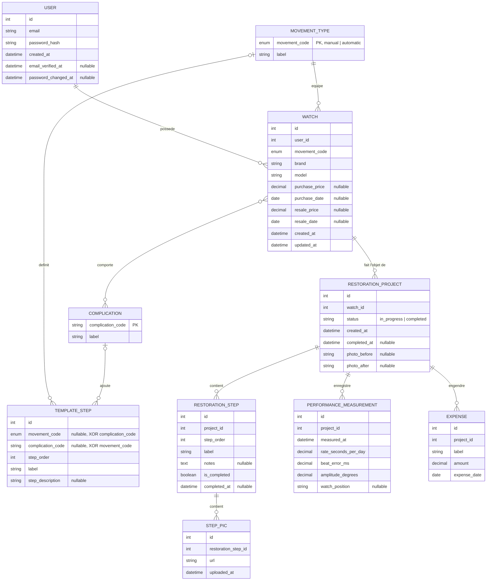

# Conception — Évolution du MCD : montre, complications et génération des étapes

**Date :** 2026-09-23 (mis à jour le 2026-10-07 : un seul projet en cours par montre, réouverture, suppressions ; voir `docs/REGLES-GESTION.md`)
**Remplace :** la section « Modèle de données » du premier document de conception (2026-07-02).
**Raisonnement et alternatives écartées :** `docs/MCD/2026-09-23-journal-decisions-mcd.md`.
**Rendu du MCD (mis à jour le 2026-10-06 d'après le schéma SQL) :** `docs/MCD/MCD-mermaid-2026-10-06.png`.

## Motivations

1. **Besoin réel : les complications.** Une montre peut cumuler plusieurs complications (ex : chronographe + date), et une complication se retrouve sur de nombreuses montres. C'est une association **many-to-many** naturelle — qui répond aussi à l'objectif de présenter au jury un MCD couvrant les différents types de relations. (Un statut en N-N a été écarté : un projet n'a qu'un statut à la fois, ce serait artificiel.)
2. **Génération automatique des étapes.** À la création d'une intervention, la liste d'étapes est composée à partir du **type de mouvement** et des **complications** de la montre, dans un ordre proposé, puis ajustable.
3. **Historique d'une même montre.** Un horloger peut réviser ou restaurer à nouveau une montre qu'il a gardée. Sans entité montre, il faudrait tout ressaisir dans un nouveau projet, sans lien entre les deux.
4. **Normalisation.** Le type de mouvement, les complications, l'achat et la revente décrivent la montre et sa possession, pas une intervention : les laisser sur `RESTORATION_PROJECT` les dupliquerait à chaque intervention.

## Décisions

| Sujet | Décision |
|---|---|
| Types de mouvement | Entité de référence `MOVEMENT_TYPE`. v1 : **manuel** et **automatique** uniquement (quartz hors périmètre). « Chronographe » n'est plus un type de mouvement : c'est une complication. |
| Complications | Entité de référence `COMPLICATION`, associée en N-N à `WATCH`. |
| Étapes types | `CHECKLIST_TEMPLATE` est supprimé. Une bibliothèque `TEMPLATE_STEP` rattache chaque étape **soit** à un type de mouvement (étapes de base), **soit** à une complication — exclusivité stricte. |
| Étapes d'une complication | Identiques quel que soit le type de mouvement. |
| Ordonnancement | `step_order` sur une **échelle commune espacée** (100, 200…) : les étapes d'une complication s'intercalent entre les étapes de base (ex : 380). |
| Montre | Nouvelle entité `WATCH` : porte marque/modèle, mouvement, complications, achat et revente. Une montre a 0..n interventions (`RESTORATION_PROJECT`). |
| Intervention | `RESTORATION_PROJECT` = une intervention sur une montre. **Pas de type d'intervention** (restauration/révision) en v1. |
| Statut | Sur `RESTORATION_PROJECT` : `in_progress` (en cours, par défaut) / `completed` (terminé) — mêmes codes que les plans existants, qui n'implémentaient déjà pas « à restaurer ». « Vendu » n'est plus un statut de projet : l'état vendu de la montre se déduit de `resale_date` renseignée. La date de fin `completed_at` est renseignée quand le projet passe à `completed`, et effacée s'il est rouvert. |
| Un seul projet en cours | Une montre n'a qu'un projet `in_progress` à la fois : index unique partiel sur `restoration_projects (watch_id) WHERE status = 'in_progress'`. Un projet terminé peut être rouvert si la montre n'est pas vendue et n'a aucun autre projet en cours. |
| Montre vendue | Aucun projet ne peut être ouvert ni rouvert sur une montre vendue en v1 ; la revente peut être corrigée ou annulée. Une intervention après revente (avec une entité « prestation » portant le montant facturé à l'acheteur) est reportée à une version ultérieure. |
| Suppressions | Un projet, une montre ou un compte peut être supprimé : les clés étrangères en cascade suppriment les données dépendantes, et le service efface les fichiers photos. Une montre peut rester sans projet. |
| Marge | Calculée **par montre** : `resale_price − purchase_price − Σ coûts de tous ses projets`. Non calculable tant que la montre n'est pas vendue, **ou si le prix d'achat est inconnu** (`purchase_price` et `purchase_date` sont facultatifs : une montre gardée de longue date peut ne plus avoir de prix ni de date d'achat connus). |
| Coûts | Un coût = libellé, montant, date. |
| Vérification d'email | `email_verified_at` et `password_changed_at` sur `USER` : les jetons de vérification et de réinitialisation sont des JWT sans état dont la validité est comparée à ces deux dates (aucune table de jetons). |
| Modification des complications après coup | Choix A : les étapes sont copiées **une seule fois**, à la création du projet. Modifier les complications de la montre n'affecte pas les projets existants, seulement les suivants. Ajustements en cours de projet : étapes personnalisées. |
| Personnalisation des modèles par l'utilisateur | Reste en backlog v2, retirée du MCD v1. |

## MCD

`RESTORATION_PROJECT.created_at` est ajouté pour ordonner l'historique des interventions d'une montre. `RESTORATION_PROJECT.completed_at` (date de fin d'une intervention) et `WATCH.created_at` / `WATCH.updated_at` (dates techniques) figurent aussi dans le schéma SQL, qui est la référence du modèle physique.

### Cardinalités (notation Merise, pour la soutenance)

| Association | Côté A | Côté B | Type |
|---|---|---|---|
| USER — **possède** — WATCH | USER (0,n) | WATCH (1,1) | 1-N |
| MOVEMENT_TYPE — **équipe** — WATCH | MOVEMENT_TYPE (0,n) | WATCH (1,1) | 1-N |
| WATCH — **comporte** — COMPLICATION | WATCH (0,n) | COMPLICATION (0,n) | **N-N** |
| WATCH — **fait l'objet de** — RESTORATION_PROJECT | WATCH (0,n) | RESTORATION_PROJECT (1,1) | 1-N |
| MOVEMENT_TYPE — **définit** — TEMPLATE_STEP | MOVEMENT_TYPE (0,n) | TEMPLATE_STEP (0,1) | 1-N, optionnelle côté étape |
| COMPLICATION — **ajoute** — TEMPLATE_STEP | COMPLICATION (0,n) | TEMPLATE_STEP (0,1) | 1-N, optionnelle côté étape |
| RESTORATION_PROJECT — contient / enregistre / engendre — RESTORATION_STEP, PERFORMANCE_MEASUREMENT, EXPENSE | RESTORATION_PROJECT (0,n) | (1,1) | 1-N |
| RESTORATION_STEP — **contient** — STEP_PIC | RESTORATION_STEP (0,n) | STEP_PIC (1,1) | 1-N |

**Contrainte d'exclusivité (XOR)** sur `TEMPLATE_STEP` : exactement un des deux liens « définit » / « ajoute » est renseigné.

**Contrainte d'unicité conditionnelle** sur `RESTORATION_PROJECT` : au plus un projet « en cours » par montre.

**Contraintes de valeur** : `beat_error_ms` et `amplitude_degrees` positifs ou nuls ; `resale_date` postérieure ou égale à `purchase_date` lorsque les deux sont connues.

### Passage au MPD

- **Noms des tables :** `USER` → `users`, `MOVEMENT_TYPE` → `movement_types`, `COMPLICATION` → `complications`, `WATCH` → `watches`, `TEMPLATE_STEP` → `template_steps`, `RESTORATION_PROJECT` → `restoration_projects`, `RESTORATION_STEP` → `restoration_steps`, `STEP_PIC` → `step_pics`, `PERFORMANCE_MEASUREMENT` → `performance_measurements`, `EXPENSE` → `expenses`, et la table d'association `comporte`.
- **Identifiants :** colonnes `INTEGER GENERATED ALWAYS AS IDENTITY` pour toutes les tables de données (voir Q18 du journal). Les deux tables de référence `MOVEMENT_TYPE` et `COMPLICATION` ont pour clé primaire leur code métier (stable, alimenté par le seed) ; `movement_code` est un type `ENUM` PostgreSQL (`manual`, `automatic`), ce qui permet d'ajouter le quartz par une simple migration `ALTER TYPE … ADD VALUE`.
- L'association N-N « comporte » devient la table **`comporte(watch_id, complication_code)`**, clé primaire composite, deux clés étrangères (suppression en cascade côté `watch`).
- Contrainte XOR : `CHECK ((movement_code IS NULL) <> (complication_code IS NULL))` sur `template_steps`. S'y ajoutent `UNIQUE (movement_code, step_order)` et `UNIQUE (complication_code, step_order)` : pas deux étapes au même rang dans une même liste (le rang reste commun entre listes, d'où le départage à égalité), ainsi que `UNIQUE (movement_code, label)` et `UNIQUE (complication_code, label)` : pas deux étapes de même libellé dans une même liste (un même libellé reste permis dans deux listes différentes). Prisma ne sait pas l'exprimer dans le schéma : elle est ajoutée dans une migration SQL manuelle, et vérifiée aussi par les tests.
- Contraintes ajoutées le 2026-10-07 : `chk_performance_measurements_beat_error`, `chk_performance_measurements_amplitude`, `chk_watches_resale_after_purchase` et l'index unique partiel `uq_restoration_projects_one_in_progress`. Comme le XOR, elles passent par une migration SQL manuelle et sont vérifiées par les tests.
- Index sur toutes les clés étrangères (cohérent avec la section éco-conception).
- `MOVEMENT_TYPE`, `COMPLICATION` et `TEMPLATE_STEP` sont des **données de référence** alimentées par le seed, en lecture seule pour les utilisateurs.

## Règle de génération des étapes

Entrée : un type de mouvement + un ensemble (éventuellement vide) de complications.

1. Sélectionner les `TEMPLATE_STEP` dont `movement_code` = le type de mouvement.
2. Y ajouter les `TEMPLATE_STEP` dont `complication_code` ∈ les complications de la montre.
3. Trier par `step_order` croissant ; à égalité, étapes de base d'abord, puis par `code` de complication (ordre déterministe).
4. Renvoyer cette liste comme **aperçu** (`GET /step-previews`) : l'utilisateur l'ajuste côté client.
5. À la validation, la liste ajustée est envoyée avec la création de la montre (`POST /watches`) ou d'une intervention (`POST /watches/:id/projects`), renumérotée 1, 2, 3… et **copiée** dans `RESTORATION_STEP` (`label`, `step_order`), `notes` vide, `completed = false`, dans la même écriture que le projet (atomique).

La décision de conception clé d'origine est conservée : copie et non référence — adapter les étapes d'un projet n'affecte jamais la bibliothèque ni les autres projets.

### Exemple

Montre à remontage **manuel** avec **chronographe** + **date**. Le référentiel complet (22 étapes de base pour un manuel, 24 pour un automatique, 5 complications) est décrit dans `Etapes-desassemblage-reassemblage.md` et alimenté par `db/seed_reference_data.sql` du dépôt du projet (voir Q22 du journal). La liste composée compte 30 étapes ; extrait :

| step_order | Étape | Origine |
|---|---|---|
| 100 | Désarmer le ressort de barillet | base manuel |
| 300 | Déposer les aiguilles | base manuel |
| 350 | Déposer les aiguilles chrono | chronographe |
| 400 | Déposer le cadran | base manuel |
| 420 | Déposer le module calendrier | date |
| 500 | Déposer les éléments côté cadran | base manuel |
| 550 | Déposer le module chronographe | chronographe |
| … | … | … |
| 1700 | Vérifier le fonctionnement du mouvement de base | base manuel |
| 1730 | Remonter le module chronographe | chronographe |
| 1800 | Remonter les éléments côté cadran | base manuel |
| 1850 | Remonter le module calendrier | date |
| 1900 | Poser le cadran | base manuel |
| 2050 | Poser les aiguilles chrono | chronographe |
| 2100 | Régler et mesurer la marche | base manuel |
| 2150 | Tester les fonctions chrono | chronographe |
| 2160 | Tester le saut de date | date |
| 2200 | Emboîter et tester | base manuel |

Chaque type de mouvement possède sa liste de base complète (la liste « automatique » ajoute la dépose et la pose du rotor et du module automatique, rangs 250 et 1770).

## Parcours utilisateur impactés

**Vocabulaire :** l'interface parle toujours de « projet » (terme des maquettes, compris de l'utilisateur). « Intervention » est le terme de conception qui désigne ce qu'est un `RESTORATION_PROJECT` dans le MCD : une intervention sur une montre.

- **Nouveau projet** (point d'entrée unique, bouton « + Nouveau projet ») — formulaire en deux temps :
  1. **Nouvelle montre** par défaut (cas courant) : marque/modèle, type de mouvement, complications, prix + date d'achat. Un lien secondaire « Sur une montre déjà suivie ? » bascule vers la liste filtrable des montres non vendues et sans projet en cours.
  2. **Étapes proposées** — aperçu généré (mouvement + complications, les étapes issues d'une complication portent son nom), ajustable (ajout, suppression, réordonnancement), puis « Créer le projet ».

  Nouvelle montre → `POST /watches` : la montre, ses complications, son premier projet et ses étapes sont créés **dans une seule écriture** (atomique). Montre existante → `POST /watches/:id/projects` : rien n'est ressaisi. Aucune route supplémentaire.
- **Tableau de bord** : liste de **montres**. Carte : miniature (photo du projet le plus récent — `photo_after` si présente, sinon `photo_before`), marque/modèle, `mouvement · complications`, statut du projet le plus récent (« En cours » / « Terminé ») ou « Vendue », ou « Sans projet » (sans miniature) si la montre n'a aucun projet ; marge si vendue. Un tap ouvre l'écran de détail de la montre.
- **Écran de détail unique** (`/watches/:id`, projet le plus récent par défaut) — la fiche montre et le détail projet sont **un seul et même écran**, qui ne révèle l'historique que s'il existe (divulgation progressive, voir Q17 du journal) :
  - **1 projet (cas courant)** : en-tête de la montre, checklist, performances, **Finances complètes** (achat, coûts, revente, marge), avant/après — identique au détail projet maquetté à l'origine ; aucune notion de « fiche montre » ou d'historique visible.
  - **≥ 2 projets** : même écran + un sélecteur de projet ; checklist, performances et avant/après suivent le projet sélectionné ; les **Finances restent au niveau montre, au même endroit** (coûts regroupés par projet, marge globale).
  - **0 projet** (après suppression du dernier) : en-tête de la montre et Finances (achat, revente) ; la checklist, les performances et l'avant / après sont absents.
  - **« Nouvelle révision sur cette montre »** : non proposée tant qu'un projet est en cours (une montre n'a qu'un projet en cours à la fois), mise en avant quand aucun projet n'est en cours (projet le plus récent terminé, ou montre sans projet) et que la montre n'est pas vendue, absente si la montre est vendue. Elle ouvre directement l'étape 2 du formulaire pour cette montre.
- **Modifier la montre** (dont complications) : depuis l'écran de détail ; sans effet sur les étapes des projets existants.
- **Renseigner la revente** : dans le bloc Finances de l'écran de détail ; `resale_price` et `resale_date` sont renseignés ensemble ou pas du tout. La revente peut y être corrigée ou annulée.
- **Rouvrir un projet terminé** : depuis le projet sélectionné ; refusé si la montre est vendue (annuler d'abord la revente) ou si un autre projet est en cours.
- **Supprimer un projet ou une montre** : après confirmation, depuis l'écran de détail ; la suppression est définitive et entraîne celle des données dépendantes.
- **Statuts affichés** : « En cours » et « Terminé » pour un projet, « Vendue » ou « Sans projet » pour une montre. L'ancien statut « À restaurer » est abandonné.
- **Calibre** : pas d'attribut dédié ; l'utilisateur l'inclut dans la marque/modèle (« Seiko 6119-8100 »). Les fiches calibre restent en backlog v2.

Le MCD n'est pas affecté par ces choix d'interface : il reste normalisé (montre 1-N projets, finances portées par la montre) ; c'est la couche de présentation qui s'adapte à la fréquence des usages.

Les use cases « Instancier une checklist depuis un modèle » (`<<extend>>` de « Créer un projet ») disparaissent au profit de la génération intégrée à « Nouveau projet ».

**Maquettes de référence :** réalisées sur Figma (nouveau projet, détail de la montre en mobile et desktop avec une ou plusieurs interventions, tableau de bord).

## Tests unitaires ajoutés

- Génération : mouvement seul ; mouvement + une complication ; mouvement + plusieurs complications (intercalage vérifié) ; départage à `step_order` égal.
- Contrainte XOR : insertion d'une étape type avec les deux liens, ou aucun, rejetée.
- Transaction de création : aucune montre ni projet persistés si la création des étapes échoue.
- Marge : somme des coûts sur plusieurs interventions d'une même montre ; marge non calculée tant que la montre n'est pas vendue, ni lorsque le prix d'achat est inconnu.
- Autorisation : accès à une montre (et à ses interventions) d'un autre utilisateur refusé (IDOR).
- Projet en cours unique : un second projet en cours sur la même montre est refusé (service et index unique) ; la réouverture est refusée si un autre projet est en cours ou si la montre est vendue.
- Contraintes de valeur : un beat error ou une amplitude négatifs, et une revente antérieure à l'achat, sont rejetés par la base.
- Suppression : supprimer un projet efface ses étapes, photos, mesures et coûts mais conserve la montre ; supprimer une montre efface tous ses projets ; la marge est recalculée après suppression d'un projet.

## Hors périmètre v1

- Type d'intervention (restauration / révision).
- Mouvements quartz.
- Étapes dépendant d'un couple (mouvement, complication).
- Synchronisation des étapes d'un projet en cours quand les complications de la montre changent.
- Modèles d'étapes personnalisés par l'utilisateur.
- Intervention après revente d'une montre (entité « prestation » portant le montant facturé à l'acheteur).
