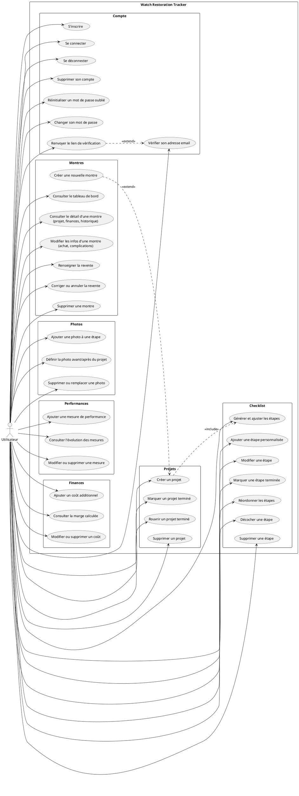
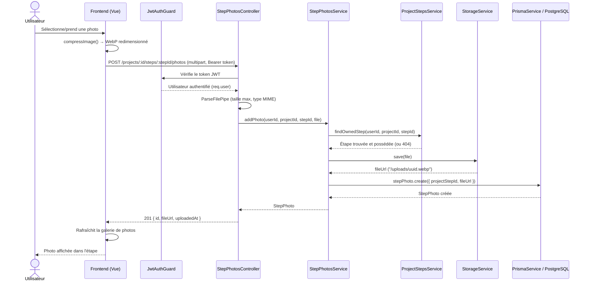
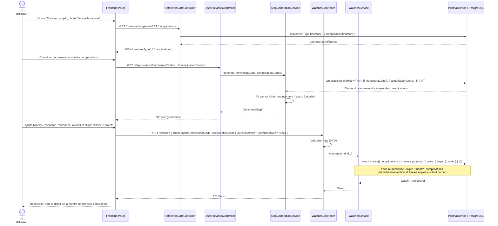

# Diagrammes UML — Watch Restoration Tracker

**Date :** 2026-07-08 (mis à jour le 2026-09-23 : entité montre, complications, génération des étapes ; le 2026-10-06 : clés par code pour les données de référence, marque et modèle séparés, prix d'achat facultatif, cas d'utilisation « Réordonner les étapes » ; le 2026-10-07 : cas d'utilisation de correction, de réouverture et de suppression, correspondant aux scénarios S28 à S38 de `docs/SPECS.md`, puis cas d'utilisation de vérification d'adresse, de réinitialisation et de changement de mot de passe, correspondant aux scénarios S1 à S4 ; puis le cas « Renvoyer le lien de vérification » (S39) et le renommage de l'acteur en « Utilisateur »)
**Contenu :** diagramme de cas d'utilisation (PlantUML) et les deux diagrammes de séquence identifiés en conception comme les plus significatifs (Mermaid).

## Diagramme de cas d'utilisation

Un seul acteur : l'utilisateur (horloger amateur), connecté ou non selon le cas d'utilisation : l'inscription, la vérification d'adresse et la réinitialisation d'un mot de passe oublié précèdent la connexion. Pas d'acteur admin ni de service externe en v1. Les cas d'utilisation sont groupés par domaine fonctionnel pour la lisibilité — le groupement n'a pas de valeur sémantique UML, seules les associations et les relations `<<include>>` / `<<extend>>` en ont.

Les relations traduisent les décisions de conception du 2026-09-23 (voir `docs/MCD/2026-09-23-mcd-montre-complications-design.md`) :

- **`<<include>>` « Créer un projet » → « Générer et ajuster les étapes »** : la génération des étapes (à partir du type de mouvement et des complications de la montre, avec un aperçu ajustable) fait **obligatoirement** partie de la création d'un projet. Elle remplace l'ancienne instanciation optionnelle d'un modèle de checklist, supprimée avec l'entité `CHECKLIST_TEMPLATE`.
- **`<<extend>>` « Créer une nouvelle montre » → « Créer un projet »** : « Nouveau projet » est le point d'entrée unique. L'utilisateur choisit une montre existante ou, si elle n'existe pas encore, la crée à ce moment-là : la création de la montre est une extension optionnelle du cas « Créer un projet ». Une montre existante est réutilisée sans ressaisie, ce que l'entité montre rend possible (historique des projets d'une même montre).
- **`<<extend>>` « Renvoyer le lien de vérification » → « Vérifier son adresse email »** : la vérification se fait normalement avec le premier lien reçu à l'inscription ; le renvoi n'intervient que si ce lien est perdu ou expiré. Il étend donc le cas de base de façon optionnelle, sans en faire partie (S39).

**Cas d'utilisation ajoutés le 2026-10-07** (scénarios S28 à S38) : rouvrir un projet terminé, supprimer un projet, supprimer une montre, corriger ou annuler la revente, décocher ou supprimer une étape, supprimer ou remplacer une photo, modifier ou supprimer une mesure ou un coût, supprimer son compte. Ce sont de simples associations avec l'acteur, sans `<<include>>` ni `<<extend>>` : leurs conditions (montre non vendue, aucun autre projet en cours, confirmation avant suppression) sont des règles de gestion, détaillées dans `docs/REGLES-GESTION.md`. La limitation des tentatives répétées (S36) n'est pas un cas d'utilisation : c'est un comportement du système, sans objectif propre pour l'acteur, qui s'applique à des cas existants (connexion, réinitialisation du mot de passe, renvoi du lien de vérification).

**Cas d'utilisation ajoutés pour les scénarios S1 à S4** : vérifier son adresse email (S1, S2), réinitialiser un mot de passe oublié (S3) et changer son mot de passe (S4). « S'inscrire » et « Vérifier son adresse email » restent deux cas distincts, car la vérification est une action ultérieure de l'utilisateur (ouvrir le lien reçu). Elle est un préalable à « Se connecter » (S2, `RG-CPT-06`) ; le diagramme ne le porte pas, car une précondition n'est ni un `<<include>>` ni un `<<extend>>`. « Réinitialiser un mot de passe oublié » regroupe la demande de lien et la saisie du nouveau mot de passe, qui forment un seul scénario (S3). L'acteur s'appelle « Utilisateur » et non « Utilisateur authentifié » : l'inscription, la vérification, le renvoi du lien et la réinitialisation précèdent la connexion.

Dans l'interface, « projet » désigne ce que le MCD appelle une intervention sur une montre. Depuis le 2026-09-25, la consultation d'une montre et de ses projets est **un seul cas d'utilisation** (`UC6`), réalisé par un seul écran : l'historique des projets n'y apparaît que lorsque la montre en a plusieurs (voir Q17 du journal de décisions `docs/MCD/2026-09-23-journal-decisions-mcd.md`).

**Rendu :** pas d'outil PlantUML disponible dans cette session pour le valider automatiquement — à rendre toi-même comme pour le MCD (plantuml.com/plantuml, extension PlantUML de VSCode, ou `plantuml` en CLI si installé).

## Diagramme de séquence 1 — Ajouter une photo à une étape

Choisi car il traverse la quasi-totalité des couches de l'architecture (frontend, garde d'authentification, contrôleur, service métier, vérification de propriété, abstraction de stockage, base de données) et touche à la fois la sécurité (validation d'upload) et l'éco-conception (compression côté client).

Validé avec l'outil Mermaid — lien d'édition/rendu : https://mermaid.ai/live/edit#pako:eNp1U8tO20AU/ZWrbGqkgGnFygskkjRRUBFuncAmm4vnJpnWnjHzCK0Q20rd9i+86U/4T/olnfE4YJTijR9zXvfhx0EuGQ2SgaZ7SyKnCceNwnIlwF2YG6lgCahhaXjBNRqyKpxVqAzPeYXCwNQjpkoKQ4JBdGPp6BA086DLB3NhzXZmUbFDyNhDMkNVupVG6rETVLIo6D+W2WtoRmrHczrEpS0wVfIr5cbj34Zmi6ApFW7oTdRkFAS5LrEDQQyp1GajKPv8aSUCZ3l8fj5NIGvqwjlzKQTFlfL9sYKg8qkDcBqAuSzdsdbz0rlHR/D352+4pbsUFDFektBeoqlfOOME0muX2am2xek44SzWvsQ48bc5i1sbDVFpC8N9FUMYESpSYOQ3Et2Uxk5tlsBNUyu+5gQFhWO4vF0ExOw4GPa2ANDNkYRxjKaGSNH9idWkepI+ICpNU15QyiuCyCB304QSvw/B/HBfruZXH3uMLAFkrJ1o5MXmbAhddf4xFDWEtRPsWJljpY625oJdPwhifsRvcztWmh0Ht+aXQRfDbZndNTUBGaik1k3N/FskLZydnvWsskUCGncU9SMsOjH/bakKiFaD2FaFRKZjazk7eaC7ajXoyUxGSRuorfQkV+Q6Gj3u42a9Mr3eU8ecjDqj57WHXDW1S7pXDk1/Pt43NizYh9P38Aj8RXgIISWxCwNPr5bxC64VNn/yLTdQIGzQ/YNuMVi3uHoPduilm3KbBddrnm993xgKDcW7pvbNHTz9A/g+e7w=

## Diagramme de séquence 2 — Créer un projet sur une nouvelle montre et générer ses étapes

Choisi car il illustre le point de logique métier central de l'application : la **génération** des étapes à partir du type de mouvement et des complications (fusion de deux sources triées sur une échelle `step_order` commune), puis leur **copie** dans le projet (et non une simple référence), qui garantit que l'adaptation d'une intervention n'affecte jamais la bibliothèque d'étapes types ni les autres projets. Il montre aussi l'écriture atomique de la montre, de ses complications (association N-N), de sa première intervention et de ses étapes.

## Note pour la soutenance

Le diagramme de séquence 1 est validé syntaxiquement (rendu Mermaid confirmé) ; le diagramme de séquence 2, réécrit le 2026-09-23, avait été validé au rendu avec mermaid-cli ; ses messages ont été retouchés le 2026-10-06 (codes à la place des identifiants, marque et modèle séparés) sans nouveau rendu : à revérifier. Tu peux les exporter en PNG/SVG (lien ci-dessus pour le 1, https://mermaid.live pour le 2), de la même manière que le MCD dans `docs/MCD/`. Le diagramme de cas d'utilisation, en PlantUML, est à rendre de ton côté faute d'outil disponible ici (complété le 2026-10-07 sans nouveau rendu : il compte désormais 35 cas d'utilisation, à revérifier visuellement) ; vérifie visuellement une fois rendu que les groupements et les relations `<<include>>` / `<<extend>>` s'affichent comme attendu.
