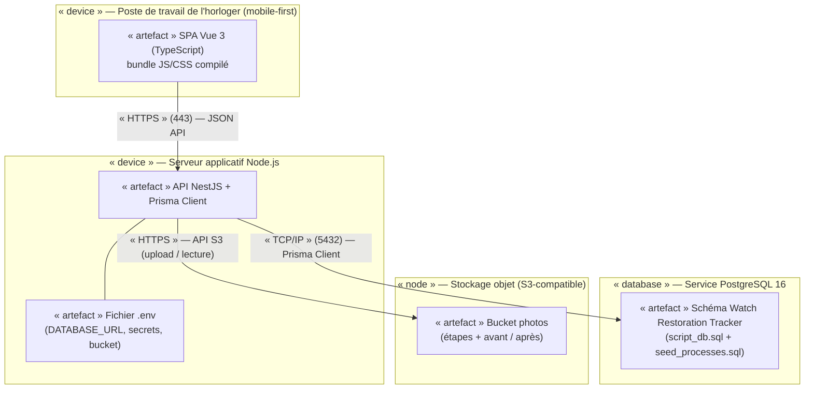
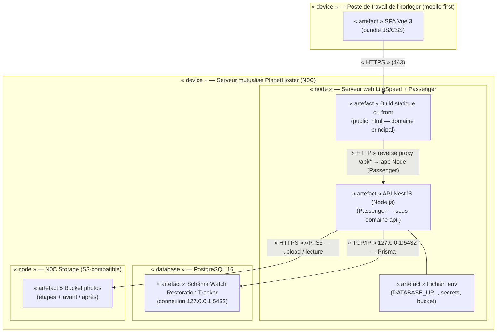

# Diagramme de déploiement UML — Watch Restoration Tracker

> Projet de fin de formation CDA — Simplon · Auteur : Clément MARTIN
> Objet : déploiement physique de la V1 — du poste de travail de l'horloger jusqu'à la cible de production.
> Deux vues proposées : une vue **générique** (indépendante de l'hébergeur) et une vue **cible** sur **hébergement mutualisé PlanetHoster (N0C)**.

---

## 1. Contexte et objectif

Le diagramme de déploiement décrit **où** s'exécutent les éléments logiciels du système et **comment ils communiquent**. Il complète le MCD/MPD (structuration des données) et les spécifications fonctionnelles (comportement attendu) en répondant à la question : *« quels nœuds physiques, quels artefacts, quelles associations de communication pour la V1 ? »*.

L'application est une web app **mobile-first** pensée pour être utilisée dans l'atelier (documentation pendant le geste). La cible de production retenue est un **serveur mutualisé PlanetHoster** : un seul nœud partagé hébergeant le front statique, l'API Node.js et PostgreSQL — sans conteneurisation (non disponible en mutualisé).

Deux niveaux de lecture sont fournis :

| Vue | Objet | Usage |
|---|---|---|
| **Générique** | Architecture logique de déploiement, sans hébergeur | Communication, réutilisable, lecture de l'architecture |
| **Mutualisé PlanetHoster** | Topologie réelle de production | Mise en œuvre, support oral, choix d'implémentation |

## 2. Rappel de l'architecture technique

La stack est actée dans la présentation orale (slide 5) : **Vue 3** côté client, **NestJS + Prisma** côté API, **PostgreSQL** pour les données — « TypeScript de bout en bout ».

| Couche | Technologie | Remarque pour le déploiement |
|---|---|---|
| Client | Vue 3 (SPA, TypeScript) | Compilé en **build statique** (JS/CSS/HTML) |
| API | NestJS (Node.js) + Prisma ORM | Processus Node.js côté serveur ; Prisma s'exécute **dans Node.js**, jamais dans le navigateur |
| Données | PostgreSQL 16 | Schéma fourni par `db/script_db.sql` + `db/seed_processes.sql` |
| Photos | Stockage objet (URLs en BDD) | Le MPD ne persiste que des URLs (`step_pics.url`, `photo_before`, `photo_after`) → les fichiers binaires vivent dans un **bucket** |

---

## 3. Diagramme 1 — Vue générique (indépendante de l'hébergeur)

Cette vue décrit l'architecture de déploiement logique : elle reste valable quel que soit l'hébergeur (mutualisé, VPS, PaaS, conteneurisé...). Elle sert de référence pour la communication et la revue d'architecture.

### 3.1 Diagramme (Mermaid)

### 3.2 Éléments UML et justifications

| Élément | Stéréotype | Rôle | Justification |
|---|---|---|---|
| Poste de travail de l'horloger | `device` | Terminal de l'utilisateur | Nœud physique d'origine des requêtes ; mobile-first → smartphone/tablette dans l'atelier |
| SPA Vue 3 | `artifact` | Interface utilisateur | Compilée en fichiers statiques servis par le serveur web |
| Serveur applicatif | `device` | Exécution de l'API | Héberge le processus Node.js et le code métier |
| API NestJS + Prisma | `artifact` | Logique métier, exposition REST | Prisma Client est **déployé sur ce nœud** (côté serveur uniquement) |
| PostgreSQL 16 | `database` | Persistance relationnelle | SGBD cible du MPD |
| Stockage objet | `node` | Stockage des photos | Cohérent avec le MPD qui ne stocke que des URLs |

### 3.3 Notes de lecture

- **Lien navigateur → API** : communication HTTP/HTTPS sur le port 443 avec des échanges JSON.
- **Lien API → BDD** : TCP/IP sur le port 5432, chiffré (SSL) ; Prisma Client est l'artefact qui réalise ce lien côté serveur.
- **Lien API → bucket** : HTTPS via l'API S3 (ou Cloudinary) ; la base ne connaît que les URLs (`step_pics.url`, `photo_before`, `photo_after`).
- **Pas de lien direct** entre le navigateur et PostgreSQL : le client n'est **jamais connecté en base** (règle de sécurité et de cohérence avec le MCD/MPD).

---

## 4. Diagramme 2 — Vue cible : hébergement mutualisé PlanetHoster (N0C)

Cette vue représente la topologie **réelle de production** retenue. Les faits techniques ci-dessous ont été vérifiés dans la base de connaissances PlanetHoster :
- **Node.js** supporté en mutualisé, applications lancées via **Passenger** (interface N0C ou SSH) ;
- **PostgreSQL** supporté, hostname de connexion **`127.0.0.1`** (et non `localhost`), gestion via phpPgAdmin ;
- **N0C Storage** : stockage objet **S3-compatible**, 50 Go inclus dès l'offre Projet Web Standard.

### 4.1 Diagramme (Mermaid)

### 4.2 Éléments UML spécifiques

| Élément | Stéréotype | Rôle sur PlanetHoster | Source |
|---|---|---|---|
| Serveur mutualisé N0C | `device` | Machine **partagée** hébergeant tous les artefacts du projet | Offre mutualisée PlanetHoster |
| LiteSpeed + Passenger | `node` | Serveur web ; sert le front statique et démarre l'application Node.js | KB PlanetHoster « Node.js » (Passenger) |
| PostgreSQL 16 | `database` | Base de données ; **hostname `127.0.0.1`**, gestion via phpPgAdmin | KB « Comment indiquer le bon hostname » |
| N0C Storage | `node` | Stockage objet **S3-compatible**, 50 Go inclus dans l'offre | Page offre mutualisée |

### 4.3 Spécificités de l'hébergement mutualisé

Dans cette topologie, le diagramme reflète des contraintes propres au mutualisé :

1. **Un seul nœud logique** : le front, l'API et la base partagent le même serveur physique. Pas de conteneurisation possible ; la séparation se fait par **dossiers** (`public_html` pour le front, dossier applicatif pour l'API) et par **sous-domaines**.
2. **Application Node.js lancée par Passenger** : pas de port public dédié pour l'API ; le serveur web proxifie les requêtes vers l'application (ex. `https://api.votredomaine.fr` ou le chemin `/api`).
3. **PostgreSQL en local** : connexion sur `127.0.0.1:5432` ; la variable `DATABASE_URL` vit dans le fichier `.env` du nœud applicatif, jamais dans le code source ni dans le front.
4. **Certificat SSL géré par l'hébergeur** (gratuit) ; le lien navigateur → serveur est donc en HTTPS.
5. **Déploiement par SSH + Git** : le code (API) et le build du front sont poussés via SSH ; pas de pipeline CI intégré à la cible.

---

## 5. Comparaison des deux vues

| Aspect | Vue générique | Vue mutualisée PlanetHoster |
|---|---|---|
| Nombre de nœuds `device` | 3 (client, serveur applicatif, BDD) | 2 (client, serveur mutualisé) |
| Hébergement de l'API | Nœud applicatif dédié | Même nœud que le front et la base |
| Conteneurisation | Possible (Docker) | **Non disponible** en mutualisé |
| Gestion du processus Node | Système d'init / orchestrateur | **Passenger** (interface N0C ou SSH) |
| Stockage des photos | Bucket S3 générique | **N0C Storage** (S3-compatible, inclus) |
| Connexion PostgreSQL | Hôte distant + SSL | Hôte local `127.0.0.1`, port 5432 |
| Front | Servi par un serveur web quelconque | Dossier `public_html` du domaine principal |

## 6. Points de vigilance (à garder en tête pour l'oral)

1. **Prisma est côté serveur** : déjà souligné dans les notes de vigilance de la présentation orale — le diagramme de déploiement le matérialise : Prisma Client est un artefact du nœud applicatif, jamais du navigateur.
2. **Version de Node.js imposée par l'hébergeur** : l'environnement mutualisé fixe les versions disponibles ; à vérifier pour la compatibilité NestJS/Prisma avant déploiement.
3. **Pas de processus long garanti** : en mutualisé, le process Node vit via Passenger ; une logique d'arrière-plan lourde (jobs, WebSocket) n'est pas adaptée — préférer des requêtes synchrones ou un cache (Redis inclus dans l'offre).
4. **Hostname PostgreSQL** : `127.0.0.1` et non `localhost` (différence documentée par PlanetHoster) — une erreur classique de configuration de `DATABASE_URL`.
5. **Les fichiers `.env` ne sont jamais commités** : les secrets (mot de passe BDD, clés bucket S3) restent sur le nœud serveur uniquement.

---

## Annexe — Fichier PlantUML

Une version PlantUML des deux diagrammes est fournie dans [`docs/diagramme-deploiement.puml`](diagramme-deploiement.puml), générable en PNG/SVG avec un client PlantUML (plugin VS Code « PlantUML » ou exécution locale de `plantuml.jar`). Chacun des deux blocs `@startuml` produit une image distincte.